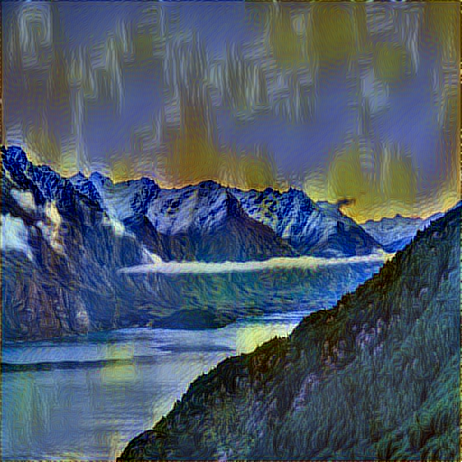
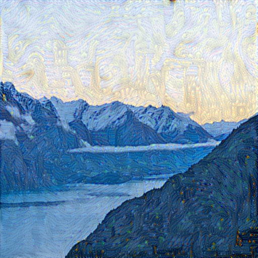
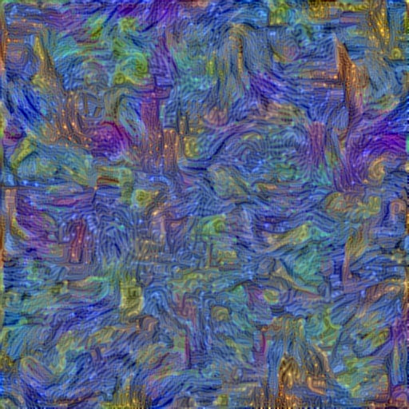

# Neural-Style-Transfer

### Keras implementation of Neural Style Transfer [Gatys et al., 2015].
<br>
Neural style transfer is a method of transferring characteristics of an image to another image using a pretrained deep convolutional neural network.

```
Author - Atharva Pusalkar
Date created - 10th August 2019
```
### <b>Usage</b>
```
python nst.py path\to\content_image path\to\style_image
```
### <b>Example</b>

Example landscape in the style of Van Gogh's "Starry Night".<br>



### <b>Model details</b>
```
Libraries used - Keras, TensorFlow, scipy, imageio, pillow and skimage.
Image dimensions - 512x512
Style weight - 1.0
Content weight - 0.025
Total variation weight - 1.0
Number of iterations - 10
```
Using "block2_conv2" layer as mentioned in the [paper](https://arxiv.org/abs/1508.06576) yields the best result with a balance between content and style.<br>

<b>block1_conv2</b><br>
The resultant image loses too much style characteristics.<br>

<br>
<b>block5_conv2</b><br>
The resultant image loses structural detail.<br>



### <b>References</b>
A Neural Algorithm of Artistic Style - https://arxiv.org/abs/1508.06576 <br>
Keras example - https://keras.io/examples/neural_style_transfer/ <br>
